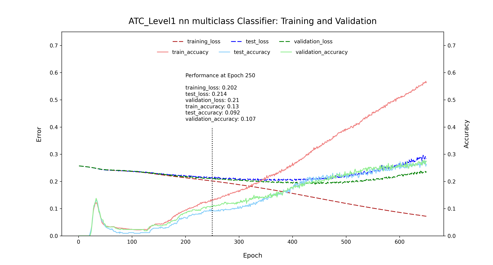
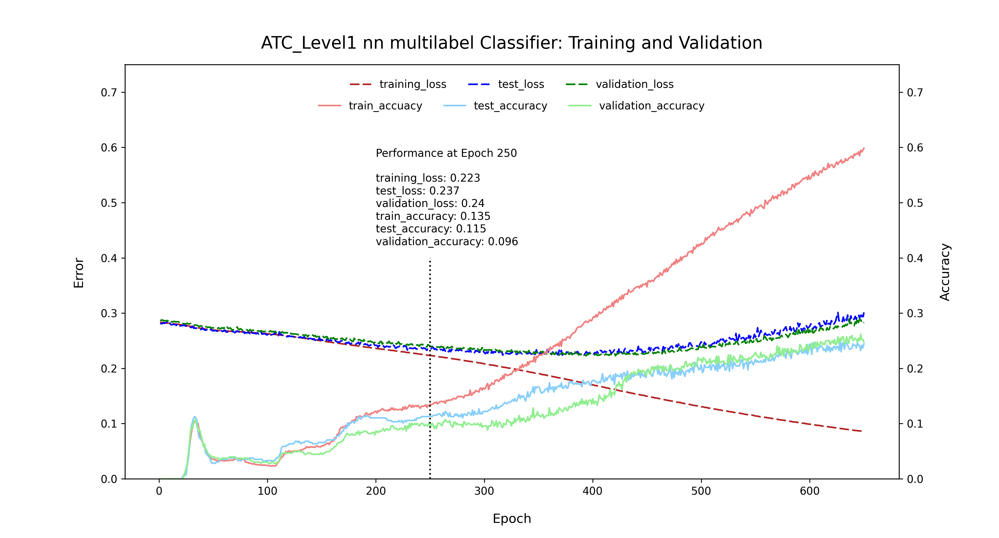

# Predict [Anotomical Therapeutic Chemical (ATC) level1](https://www.who.int/tools/atc-ddd-toolkit/atc-classification) classification for molecules via a supervised nn model

Data accessed from the [ChEMBL database](https://www.ebi.ac.uk/chembl/). Saved locally as "ATC_ChEMBL_35.csv"

As an aside, if you'd like to query the data yourself, you download a local copy of the [chembl_35](https://ftp.ebi.ac.uk/pub/databases/chembl/ChEMBLdb/latest/) as a PostgreSQL database and run the following code:

```

\copy 
(SELECT compound_structures.molregno, compound_structures.canonical_smiles, atc_classification.level1, atc_classification.level5 
FROM ((atc_classification INNER JOIN molecule_atc_classification ON atc_classification.level5 = molecule_atc_classification.level5) 
INNER JOIN compound_structures ON molecule_atc_classification.molregno = compound_structures.molregno)) 
TO '~/ATC_ChEMBL_35.csv' WITH (FORMAT CSV, HEADER);

```

Model training and validation performed with molecular fingerprints generated by RDKit from molecular smiles as inputs and ATC level1 are the outputs. Predictions were evaluated for both multiclass and multilabel classifications, i.e. true values are either one of the 14 ATC level1 classifications or true values are multiple of the 14 ATC level1 classifications respectively.

The code for the classifier can be accessed at "ATC_level1_classifier_nn.py"

The code for the plots can be accessed at "model_training_plotting.py"

Model performance is summarized in the following figures:

<p>
    
    
</p>

---
### Some thoughts

- The model begins to overfit past epoch 250
- Assessing the performance of the model at epoch 250 should give best case senario for the model
- There doesn't seem to be much difference in model performance between multiclass or multilabel at epoch 250
- Model accuracy of ~ 10 % is only slightly better than what would be expected for a random guess for multiclass with 14 classes, ~7%
- It's possible there is not enough data to train this model to a higher level of predicitive power given the complexity of the data. 